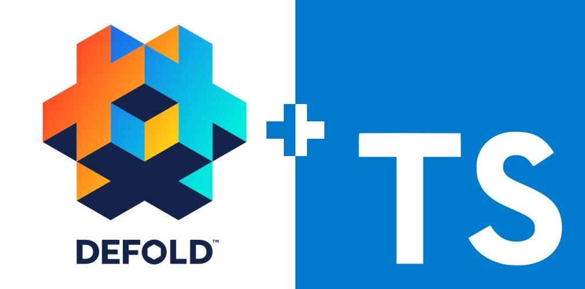

# TypeScript support for Defold game engine
TypeScript declaration files for Defold API.

## How to Install and Use.

- This repo has only TypeScript declaration files for Defold API.
- It's **recommended** to download and use Defold project template from [GitHub Releases](https://github.com/dasannikov/DefoldTypeScriptHello/releases)
- Or clone (you have to clone!! it has submodules) this [GitHub repository](https://github.com/dasannikov/DefoldTypeScriptHello)

## Code Generation
Using TypeScript you get strong type check, typed arguments, classes, inheritance and more. All reflects to Lua basic constructions. TS to Lua work the same way as TS to JS. Very useful for big projects development. Generated Lua code is very clean and human readable.

## TODO
- (DONE) Auto generate `defold.d.ts` file with full Defold support.
- (DONE) Add types to function's arguments where it's possible.
- (DONE) Add build system.
- Further development of [TypeScript to Lua Transpiler](https://github.com/Perryvw/TypescriptToLua)
